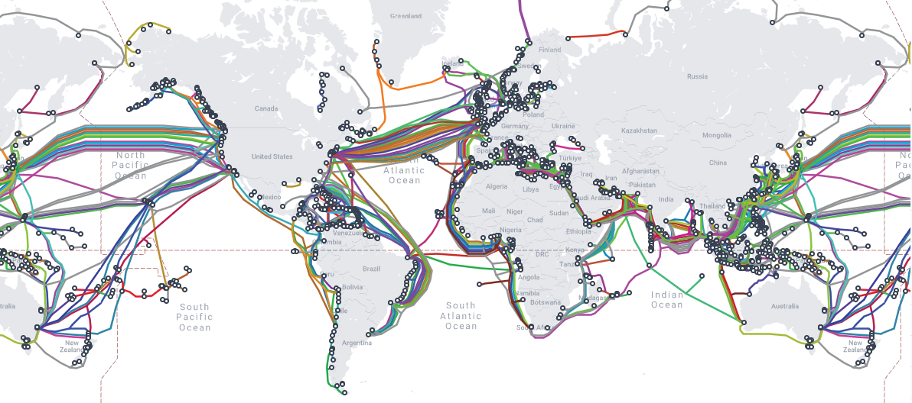

## CIFAR through the tubes: Downloading data from the internet



[:notes:](https://www.youtube.com/watch?v=_cZC67wXUTs) [:microphone:](https://en.wikipedia.org/wiki/Series_of_tubes)


<!-- https://data.gov/

https://en.m.wikipedia.org/wiki/Zettabyte_Era

https://www.domo.com/data-never-sleeps

https://rivery.io/blog/big-data-statistics-how-much-data-is-there-in-the-world/

[CIFAR](https://www.cs.toronto.edu/~kriz/cifar.html)

https://en.wikipedia.org/wiki/CIFAR-10

https://datainnovation.org/2021/10/visualizing-undersea-internet-cables/

https://www.infrapedia.com/

https://en.wikipedia.org/wiki/Internet_backbone

https://www.submarinecablemap.com/

https://www.wired.com/story/opte-internet-map-visualization/

https://en.wikipedia.org/wiki/Wget

https://en.wikipedia.org/wiki/Tar_(computing)

https://en.wikipedia.org/wiki/Secure_Hash_Algorithms

https://csrc.nist.gov/projects/hash-functions

https://edps.europa.eu/sites/edp/files/publication/19-10-30_aepd-edps_paper_hash_final_en.pdf

https://www.okta.com/identity-101/hashing-algorithms/

https://www.geeksforgeeks.org/introduction-to-hashing-data-structure-and-algorithm-tutorials/

https://cheapsslsecurity.com/blog/decoded-examples-of-how-hashing-algorithms-work/

https://en.wikipedia.org/wiki/MD5

https://en.wikipedia.org/wiki/Md5sum

https://en.wikipedia.org/wiki/SHA-2

https://en.wikipedia.org/wiki/CURL -->


```
$ ssh expanse
```

```
wget https://www.cs.toronto.edu/~kriz/cifar-10-python.tar.gz
```

```
--2022-07-26 08:50:09--  https://www.cs.toronto.edu/~kriz/cifar-10-python.tar.gz
Resolving www.cs.toronto.edu (www.cs.toronto.edu)... 128.100.3.30
Connecting to www.cs.toronto.edu (www.cs.toronto.edu)|128.100.3.30|:443... connected.
HTTP request sent, awaiting response... 200 OK
Length: 170498071 (163M) [application/x-gzip]
Saving to: ‘cifar-10-python.tar.gz’

cifar-10-python.tar 100%[===================>] 162.60M  34.0MB/s    in 5.3s    

2022-07-26 08:50:15 (30.4 MB/s) - ‘cifar-10-python.tar.gz’ saved [170498071/170498071]
```

```
[xdtr@login02 ~]$ ls -lh
total 163M
-rw-r--r-- 1 xdtr abc123 163M Jun  4  2009 cifar-10-python.tar.gz
```

```
tar -xf cifar-10-python.tar.gz
```

```
[xdtr@login02 ~]$ ls -lh
total 163M
drwxr-xr-x 2 xdtr abc123   10 Jun  4  2009 cifar-10-batches-py
-rw-r--r-- 1 xdtr abc123 163M Jun  4  2009 cifar-10-python.tar.gz
```

```
[xdtr@login02 ~]$ ls -lh cifar-10-batches-py/
total 177M
-rw-r--r-- 1 xdtr abc123 158 Mar 30  2009 batches.meta
-rw-r--r-- 1 xdtr abc123 30M Mar 30  2009 data_batch_1
-rw-r--r-- 1 xdtr abc123 30M Mar 30  2009 data_batch_2
-rw-r--r-- 1 xdtr abc123 30M Mar 30  2009 data_batch_3
-rw-r--r-- 1 xdtr abc123 30M Mar 30  2009 data_batch_4
-rw-r--r-- 1 xdtr abc123 30M Mar 30  2009 data_batch_5
-rw-r--r-- 1 xdtr abc123  88 Jun  4  2009 readme.html
-rw-r--r-- 1 xdtr abc123 30M Mar 30  2009 test_batch
```

```
md5sum cifar-10-python.tar.gz
```

```
c58f30108f718f92721af3b95e74349a  cifar-10-python.tar.gz
```

```
md5sum cifar-10-python.tar.gz > cifar-10-python.md5
```

```
[xdtr@login02 ~]$ ls -lh
total 163M
drwxr-xr-x 2 xdtr abc123   10 Jun  4  2009 cifar-10-batches-py
-rw-r--r-- 1 xdtr abc123   57 Jul 26 08:53 cifar-10-python.md5
-rw-r--r-- 1 xdtr abc123 163M Jun  4  2009 cifar-10-python.tar.gz
```

```
[xdtr@login02 ~]$ md5sum -c cifar-10-python.md5 
cifar-10-python.tar.gz: OK
```

```
curl https://www.cs.toronto.edu/~kriz/cifar-10-python.tar.gz -o cifar-10-python.tgz
```

```
  % Total    % Received % Xferd  Average Speed   Time    Time     Time  Current
                                 Dload  Upload   Total   Spent    Left  Speed
100  162M  100  162M    0     0  28.1M      0  0:00:05  0:00:05 --:--:-- 33.3M
```

```
[xdtr@login02 ~]$ ls -lh
total 326M
drwxr-xr-x 2 xdtr abc123   10 Jun  4  2009 cifar-10-batches-py
-rw-r--r-- 1 xdtr abc123   57 Jul 26 08:53 cifar-10-python.md5
-rw-r--r-- 1 xdtr abc123 163M Jun  4  2009 cifar-10-python.tar.gz
-rw-r--r-- 1 xdtr abc123 163M Jul 26 08:54 cifar-10-python.tgz
```

```
wget https://raw.githubusercontent.com/sdsc/sdsc-summer-institute-2022/main/2.5_data_management/cifar-10-python.sha256
```

```
[xdtr@login02 ~]$ sha256sum -c cifar-10-python.sha256 
cifar-10-python.tgz: OK
```

#

[Back to Top of Page](#top)

[Back to Main Page](../README.md)

Next - [More files, more problems: Advantages and limitations of different filesystems](FILESYSTEMS.md)

